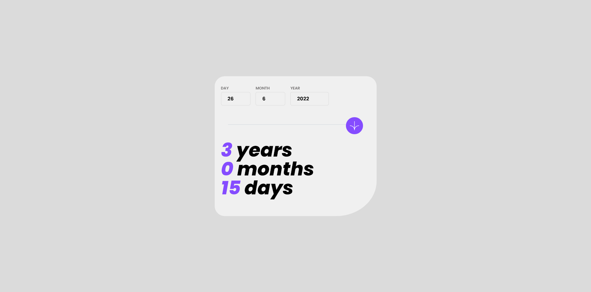

# Frontend Mentor - Age calculator app solution

Hey! It's Mel again!  

This is a solution to the [Age calculator app challenge on Frontend Mentor](https://www.frontendmentor.io/challenges/age-calculator-app-dF9DFFpj-Q). Frontend Mentor challenges help you improve your coding skills by building realistic projects. 

## Table of contents

- [Overview](#overview)
  - [The challenge](#the-challenge)
  - [Screenshot](#screenshot)
  - [Links](#links)
- [My process](#my-process)
  - [Built with](#built-with)
  - [What I learned](#what-i-learned)
  - [Continued development](#continued-development)
  - [Useful resources](#useful-resources)
- [Author](#author)
- [Acknowledgments](#acknowledgments)

**Note: Delete this note and update the table of contents based on what sections you keep.**

## Overview

### The challenge

Users should be able to:

- View an age in years, months, and days after submitting a valid date through the form
- Receive validation errors if:
  - Any field is empty when the form is submitted
  - The day number is not between 1-31
  - The month number is not between 1-12
  - The year is in the future
  - The date is invalid e.g. 31/04/1991 (there are 30 days in April)
- View the optimal layout for the interface depending on their device's screen size
- See hover and focus states for all interactive elements on the page
- **Bonus**: See the age numbers animate to their final number when the form is submitted

### Screenshot

### Links

- Solution URL: [GitHub repo](https://github.com/decsa17/Frontend-Mentor_Age-Calculator)
- Live Site URL: [GitHub Pages site](https://decsa17.github.io/Frontend-Mentor_Age-Calculator/)

## My process

- 1. Create HTML
- 2. Create JS functions > error validation
- 3. Style Mobile > Desktop

### Built with

- Semantic HTML5 markup
- CSS custom properties
- Tailwind Css
- Flexbox
- Mobile-first workflow
- Vanilla JS

**Note: These are just examples. Delete this note and replace the list above with your own choices**

### What I learned

- Learned more about JS and Error Validations
- refreshed knowledge with js/css error styling

### Continued development

There's probably minor issues with this project so I would not be continuing this one and move on to the next junior/intermediate challenges

## Author
- Frontend Mentor - [@decsa17](https://www.frontendmentor.io/profile/decsa17). 

## Acknowledgments

- I would like to give thanks to Frontend-Mentor for creating this tailored and amazing challenge.